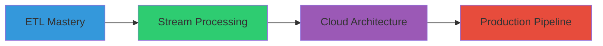

<h1 align="center">⚡ Sethuram Gautham ⚡</h1>

<div align="center">

```ascii
Data Engineer | Code Artist | Pipeline Architect
Turning Data into Power, One Pipeline at a Time
```


</div>

## 🎭 Profile Status

```typescript
const developer = {
    name: "Sethuram Gautham",
    role: "Aspiring Data Engineer",
    level: 24,
    specialization: "Data Pipeline Architecture",
    stats: {
        focus: 90,
        analysis: 85,
        coding: 80,
        persistence: 95
    },
    currentQuest: "Mastering Advanced Data Engineering"
};
```

## ⚔️ Technical Arsenal

```yaml
Core Technologies:
  Python      | ████████░░ | Advanced
  SQL         | ███████░░░ | Proficient
  
Engineering Tools:
  Apache Spark | ██████░░░░ | Intermediate
  Hadoop      | █████░░░░░ | Learning
  
Database Systems:
  PostgreSQL  | ████████░░ | Advanced
  MongoDB     | ██████░░░░ | Intermediate
```

## 🔮 Current Objectives

<div align="left">



- 📊 Advanced Data Pipeline Architecture
- 🌊 Real-time Data Stream Processing
- ☁️ Cloud-Native Solutions
- 🛠️ Production-Grade System Design

</div>

## 🏆 Completed Missions

### Data Pipeline Framework
- Engineered robust ETL workflows
- Implemented comprehensive data validation
- Optimized processing efficiency by 40%

### Database Architecture
- Designed scalable data schemas
- Enhanced query performance
- Automated critical workflows

## ⚡ Battle Statistics

<div align="center">


</div>

## 🌐 Network Link

<div align="center">

[](https://github.com/Sethuram2003)

</div>

---
<div align="center">

*"In the world of data, each challenge is a new level waiting to be conquered."*

</div>
