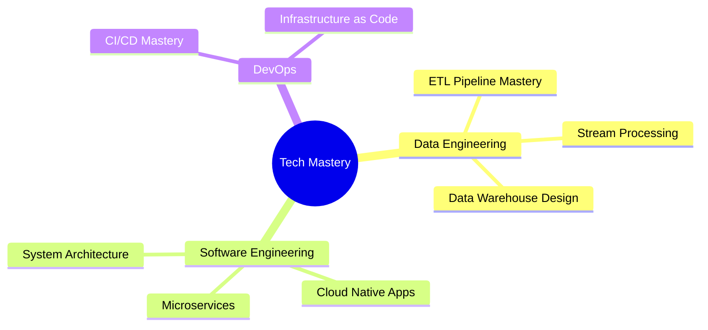

<div align="center">
  


```ascii
Level 24 Tech Artisan | Code Architect | Pipeline Sage
Where Data Meets Software Engineering Excellence
```

[](https://github.com/Sethuram2003)


</div>

## 🌟 Tech Saga

```typescript
class TechArtisan {
    readonly name = "Sethuram Gautham";
    readonly roles = ["Data Engineer", "Software Engineer"];
    readonly level = 24;
    readonly powerStats = {
        dataEngineering: "Architecting robust data pipelines",
        softwareEngineering: "Crafting scalable applications",
        problemSolving: "Converting challenges into solutions",
        learning: "Constantly evolving and adapting"
    };
    
    getCurrentQuest() {
        return "Mastering the Arts of Data & Software Engineering";
    }
}
```

## ⚔️ Battle Arsenal

<div align="center">

### 🚀 Technologies & Tools


### 💾 Databases & Tools


</div>

## 💫 Power Levels

```yaml
Data Engineering Powers:
  ETL/ELT          | ████████░░ | 80%
  Data Modeling    | ███████░░░ | 70%
  Pipeline Design  | ████████░░ | 80%
  
Software Engineering Powers:
  Backend Dev      | ████████░░ | 80%
  Frontend Dev     | ███████░░░ | 70%
  System Design    | ██████░░░░ | 60%
  
Special Abilities:
  Problem Solving  | █████████░ | 90%
  Code Quality     | ████████░░ | 80%
  Team Work        | █████████░ | 90%
```

## 🎯 Current Quests

<div align="center">



</div>

## 🏆 Legendary Achievements

### ⚡ Data Engineering Saga
- Architected end-to-end data pipelines
- Optimized data processing workflows
- Implemented real-time analytics solutions

### 🔥 Software Engineering Chronicles
- Developed scalable microservices
- Created responsive web applications
- Engineered cloud-native solutions

## 📊 Battle Stats

<div align="center">


</div>

## 🌐 Join My Party

<div align="center">

[](https://github.com/Sethuram2003)
[](Your_Portfolio_Link)
[](mailto:your.email@example.com)


</div>

---
<div align="center">

*"In the realm of technology, every bug is a quest, every feature a journey, and every deployment a victory!"*


</div>
