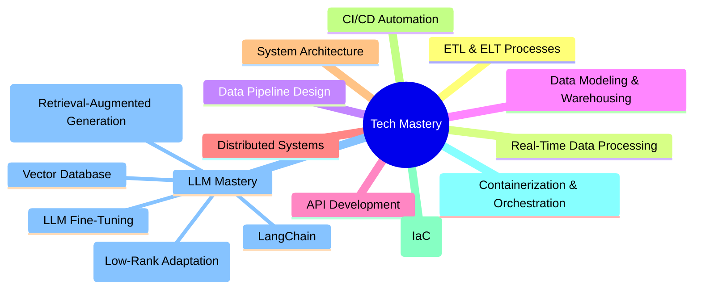

<div align="center">
  


```ascii
Level 21 Data Engineering Artisan | Code Architect | Pipeline Innovator
Bridging Data and Engineering with Excellence
```

[](https://github.com/Sethuram2003)


</div>

## 🌟 Tech Saga

```typescript
class TechArtisan {
    readonly name = "R Sethuram Gautham";
    readonly level = 21;
    readonly powerStats = {
        dataEngineering: "Building resilient data pipelines for real-time insights",
        dataArchitecture: "Designing scalable, efficient data systems",
        problemSolving: "Transforming complex data challenges into solutions",
        learning: "Evolving continuously to enhance data expertise"
    };
    
    getCurrentQuest() {
        return "Mastering the Art of Data Engineering";
    }
}
```

## ⚔️ Battle Arsenal

<div align="center">

### 🚀 Languages & Frameworks


### 💾 Databases


### 🛠 Big Data & Tools


### 🔧 Development & Monitoring


### 🤖 Automation & Scraping


</div>

## 💫 Power Levels

```yaml
Core Engineering Powers:
  ETL/ELT Processes       | ████████░░ | 85%
  Data Modeling           | ████████░░ | 80%
  Pipeline Design         | ████████░░ | 85%
  Data Analysis           | ███████░░░ | 75%
  Distributed Systems     | ██████░░░░ | 65%
  API Development         | ███████░░░ | 75%
  System Architecture     | ███████░░░ | 70%
  Kafka/Hadoop Ecosystem  | ██████░░░░ | 60%

Special Abilities:
  Problem Solving         | ██████████ | 95%
  Code Quality            | ████████░░ | 85%
  Team Work               | █████████░ | 90%
  Learning Agility        | █████████░ | 90%
```

## 🎯 Current Quests

<div align="center">



</div>

## 🏆 Legendary Achievements

### ⚡ Tech Mastery Saga
- Architected end-to-end data pipelines and optimized ETL/ELT processes
- Designed real-time analytics and data streaming solutions
- Engineered distributed systems for scalability and reliability
- Developed and deployed API-driven microservices
- Designed resilient system architectures for cloud-native environments
- Automated CI/CD pipelines and implemented Infrastructure as Code
- Leveraged containerization and orchestration for scalable applications


## 📊 Battle Stats

<div align="center">


</div>

## 🌐 Join My Party

<div align="center">

[](https://github.com/Sethuram2003)
[]((https://sethuram2003.github.io/Portfolio/))
[](mailto:sethuramgautha.rajakumar@stonybrook.edu)


</div>

---
<div align="center">

*"In the realm of technology, every bug is a quest, every feature a journey, and every deployment a victory!"*


</div>
